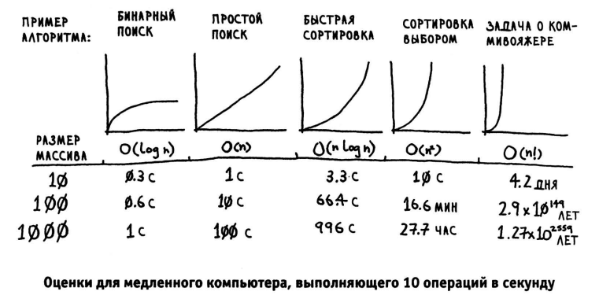

# Личная выдержка книги Бахаргава Адитья "Грокаем Алгоритмы" с примерами кода на GO #


Перевод книги совсем не инженерный.. придётся что-то переработать.

## Глава 1 -Знакомство с алгоритмами ##

Алгоритмом называется набор инструкций для выполнения некоторой 
задачи. 

Повышение скорости работы алгоритмов зачастую связано с декомпозицией (разделени целого на части) задачи. 

>>>Формулировака "Разделяй и властвуй" в книге - профанация ИМХО. 

> Предположим, вы ищете фамилию человека в телефонной книге (какая древняя технология!). Она начинается с буквы «К». Конечно, можно начать с самого начала и перелистывать страницы, пока вы не доберетесь до буквы «К». Но скорее всего для ускорения поиска лучше раскрыть книгу на середине: ведь буква «К» должна находиться где-то ближе к середине телефонной книги. Или предположим, что вы ищете слово в словаре, и оно начинается с буквы «0». И снова лучше начать с середины.

> Теперь допустим, что вы вводите свои данные при входе на Facebook. При этом Facebook необходимо проверить, есть ли у вас учетная запись на сайте. Для этого ваше имя пользователя нужно найти в базе данных. Допустим, вы выбрали себе имя пользователя ~karlrnageddon~. Facebook может начать с буквы А и проверять все подряд, но разумнее будет начать с середины. 

> Перед нами типичная задача поиска. И во всех этих случаях для решения задачи можно применить один алгоритм: бинарный поиск. Бинарный поиск - это алгоритм; на входе он получает отсортированный список элементов (позднее я объясню, почему он должен быть отсортирован). Если элемент, который вы ищете, присутствует в списке, то бинарный поиск возвращает ту позицию, в которой он был найден. В противном случае бинарный поиск возвращает null. 

### Бинарный поиск (итерационный метод в цикле) ###

``` package main

func iterBinarySearch(array []int, target int, lowIndex int, highIndex int) int {
	startIndex := lowIndex
	endIndex := highIndex
	var mid int
	for startIndex < endIndex {
		mid = int((startIndex + endIndex) / 2)
		if array[mid] > target {
			endIndex = mid
		} else if array[mid] < target {
			startIndex = mid
		} else {
			return mid
		}
	}
	return -1
}
```


### О-большое ###

>«O» большое  — математические обозначения для сравнения асимптотического поведения (асимптотики) функций. 

>> Фраза «сложность алгоритма есть  **O(f(n))**» означает, что с увеличением параметра **n**, характеризующего количество входной информации алгоритма, время работы алгоритма будет возрастать не быстрее, чем **f(n)** умноженная на некоторую константу;

Время выполнение алгоритма не всегда на прямую зависит от нотации "О" большое. Также стоит принимать во внимание скорость отработки одного шага алгоритма.

(Простой поиск - прямым перебором)



> **Шпаргалка** 
>-  Бинарный поиск работает намного быстрее простого. 
>- Время выполнения O(log п) быстрее О(п), а с увеличением размера списка, в котором ищется значение, оно становится намного быстрее. 
>-Скорость алгоритмов не измеряется в секундах. 
>- Время выполнения алгоритма описывается ростом количества операций. 
>- Время выполнения алгоритмов выражается как «О-большое~.

## Глава 2 - Сортировка выбором ## 

- Массивы и Linked Lists
- Сортировка выбором

## Глава 3 - Сортировка выбором ## 

## Глава 4 - Сортировка выбором ## 

## Глава 5 - Сортировка выбором ## 
